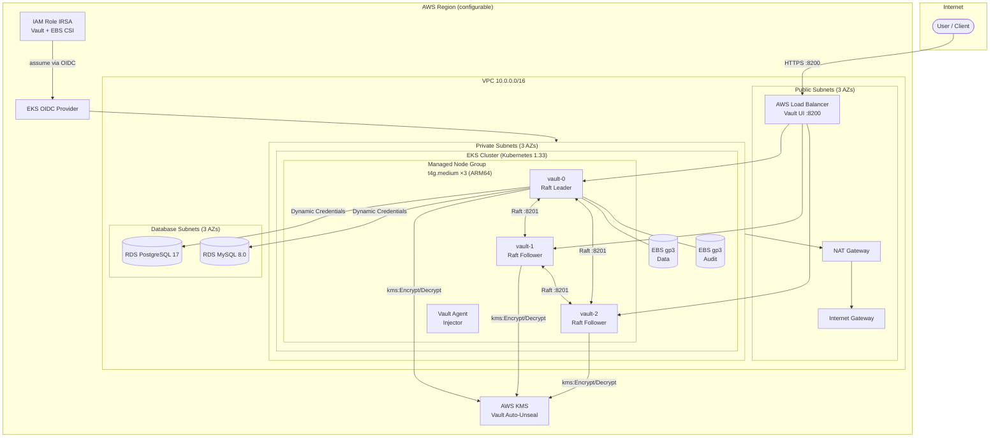

# terraform-aws-eks-vault
this readme was done by Claude, all the TF code was done by myself.

Terraform module that deploys **HashiCorp Vault Enterprise** in high-availability mode on **Amazon EKS**, complete with AWS KMS auto-unseal, TLS, IRSA, EBS persistent storage, and optional RDS databases managed by the Vault Database Secrets Engine.

---

## Architecture



---

## What Gets Deployed

| Component | Details |
|---|---|
| **EKS Cluster** | Kubernetes 1.33, public endpoint, ARM64 node group (t4g.medium, 3–6 nodes) |
| **Vault Enterprise** | v1.21.1-ent, 3-node HA via Raft, Helm chart 0.27.0 |
| **TLS** | Self-signed CA + server cert (covers all internal Vault DNS names + ELB wildcard) |
| **Auto-Unseal** | AWS KMS — Vault never needs manual unseal after restarts |
| **IRSA** | Vault pods assume an IAM role via OIDC — no static credentials on nodes |
| **Persistent Storage** | EBS gp3 StorageClass (Retain policy), 10 GiB data + 10 GiB audit per pod |
| **Vault Agent Injector** | Sidecar injection enabled for workloads in the cluster |
| **RDS PostgreSQL 17** | In database subnets; managed by Vault Database Secrets Engine |
| **RDS MySQL 8.0** | In database subnets; available for Vault dynamic credentials |
| **Vault DB Secrets** | PostgreSQL dynamic role — short-lived credentials created on demand |

---

## Prerequisites

- Terraform >= 1.3
- AWS CLI configured with sufficient permissions (EKS, VPC, KMS, IAM, RDS)
- A Vault Enterprise license
- `kubectl` and `helm` (for post-deploy steps)
- `jq` (for the init script)

---

## Usage

### 1. Configure variables

Copy and edit the tfvars file:

```hcl
# terraform.tfvars
cluster_version    = "1.33"
vault_namespace    = "vault"
vault_license      = "<your-vault-enterprise-license>"
public_key         = "<your-ssh-public-key>"
```

Root-level variables for the primary cluster:

| Variable | Default | Description |
|---|---|---|
| `primary_region` | `us-west-2` | AWS region for the primary cluster |
| `primary_cluster_name` | `primary` | EKS cluster name |
| `cluster_version` | `1.28` | Kubernetes version |
| `vault_namespace` | `vault` | Kubernetes namespace for Vault |
| `vault_license` | — | Vault Enterprise license (sensitive) |
| `vault_domain` | `vault.local` | Domain used in TLS SAN |
| `public_key` | — | SSH public key for node access |

### 2. Deploy infrastructure

```bash
terraform init
terraform plan
terraform apply
```

### 3. Access Vault

After apply, the output `primary_vault_access_instructions` prints the full steps. Summary:

```bash
# Add the cluster to your kubeconfig
aws eks update-kubeconfig --region <region> --name <cluster-name>

# Verify pods are running
kubectl get pods -n vault

# Initialize Vault (one-time only)
kubectl exec -n vault vault-0 -- vault operator init \
  -recovery-shares=7 \
  -recovery-threshold=4 \
  -format=json > ./primary-cluster-keys.json

# Get the LoadBalancer address
echo https://$(kubectl get svc vault-ui -n vault -o json | jq -r ".status.loadBalancer.ingress[0].hostname"):8200

# Export TLS CA and environment
terraform output -raw vault_ca_cert > vault-ca.crt
export VAULT_ADDR=https://<LOADBALANCER_ADDRESS>:8200
export VAULT_CACERT=vault-ca.crt
```

Or use port-forward for local access:

```bash
kubectl port-forward -n vault vault-0 8200:8200
export VAULT_ADDR=https://127.0.0.1:8200
export VAULT_CACERT=vault-ca.crt
```

---

## Module Structure

```
.
├── primary.tf                  # Root module — wires variables into ./modules
├── variables.tf                # Root-level variable declarations
├── terraform.tfvars            # Local variable values (gitignored for secrets)
├── modules/
│   ├── vpc.tf                  # VPC, subnets, NAT gateway
│   ├── eks.tf                  # EKS cluster, node group, add-ons (CoreDNS, vpc-cni, EBS CSI)
│   ├── kms.tf                  # KMS key + alias for Vault auto-unseal
│   ├── iam.tf                  # IRSA roles for Vault pods and EBS CSI driver
│   ├── tls.tf                  # Self-signed CA + Vault server certificate
│   ├── vault_k8s.tf            # Kubernetes namespace, secrets (TLS, license), StorageClass
│   ├── helm.tf                 # Helm release for Vault Enterprise (HA Raft config)
│   ├── optional_aws_db.tf      # RDS MySQL + PostgreSQL instances
│   ├── optional_aws_sg.tf      # Security groups for RDS
│   ├── outputs.tf              # Module outputs
│   ├── variables.tf            # Module variable declarations
│   └── providers.tf            # AWS, Kubernetes, Helm, TLS providers
├── vault_config_terraform/     # Vault provider config (DB secrets engine, dynamic roles)
│   ├── vault_postgres.tf       # PostgreSQL dynamic credentials via Vault DB secrets engine
│   └── aws_sql.tf              # Data sources for RDS endpoints
└── manual_helm_config/         # Reference Helm values and manual setup scripts
```

---

## Vault Configuration (vault_config_terraform)

After the cluster is running, the `vault_config_terraform` sub-directory configures Vault itself using the Vault Terraform provider:

- **PostgreSQL dynamic credentials** — Vault creates short-lived DB users on demand via the Database Secrets Engine.
- Role: `postgres-role` — grants `SELECT` on all tables, expires on TTL.

```bash
cd vault_config_terraform
terraform init
terraform apply
```

---

## Security Notes

- Vault TLS is **always enabled** — `tlsDisable: false`.
- Vault pods authenticate to AWS via **IRSA** (no static IAM keys).
- KMS key rotation is enabled.
- EBS volumes are encrypted (`encrypted = "true"`).
- IMDSv2 (`http_tokens = "required"`) is enforced on all nodes.
- The `primary-cluster-keys.json` init output contains recovery keys — store it securely and do **not** commit it.
- `terraform.tfvars` contains the Vault license and SSH key — keep it out of version control.

---

## Teardown

```bash
terraform destroy
```

> RDS instances use `skip_final_snapshot = true` — all data will be lost on destroy.
